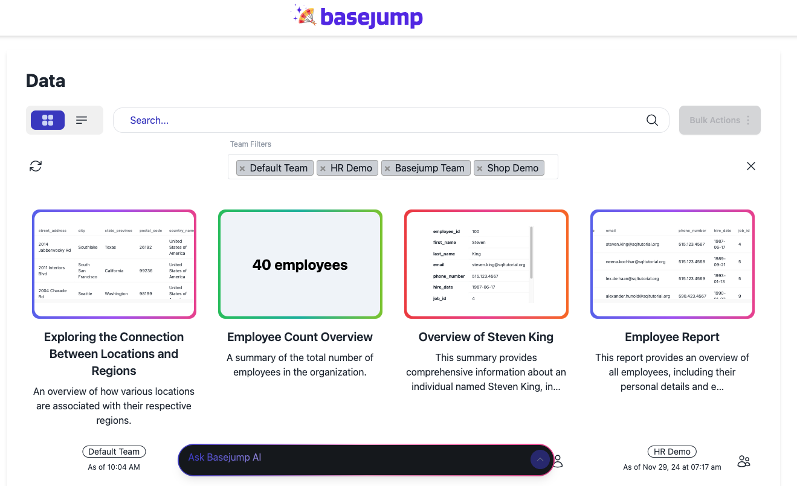
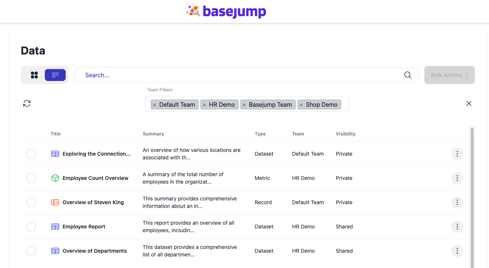
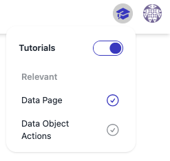

# Changelog

## Redesigned Data Page, Free Accounts, Documentation, Community, and API Release
_January 14, 2025_

There were so many changes this release! We're proud of all the changes that we managed to accomplish and share with all of you.

### TLDR
- :sparkles: There is a fresh new design for data objects
- :free: We have a new free tier! Check out the [pricing page](https://basejump.ai/pricing) for details.
- :scroll: We have new [API documentation](https://docs.basejump.ai/api/api-reference/) and Basejump AI documentation
- :space_invader: Join our [Community Discord](https://discord.gg/fUucrZyP7D)!

### Redesigned Data Page

Our data page has been redesigned along with anywhere else there is a data object throughout the app. This is what the next data page looks like:

We focused on designing the data page to have a modern feel that also highlights the data at the top of the data tile. We set the default to the tile view to make it easy to see your metrics at a glance. 

The color of each tile indicates whether the data object is a metric (green), record (orange), or dataset (purple). We also added icons in the tabular view that represent each of these three data object types.

The redesign should make it easier to browse the various data objects that have been retrieved from the Basejump data agent.

### Documentation

There was a huge focus on getting our documentation improved to make using our application simple and intuitive. The improvements in documentation include:
- API documentation overhaul. API documentation can be found here: [API Reference](https://docs.basejump.ai/api/api-reference/)
- Publishing Basejump AI documentation publicly (this documentation that you're reading)
- Creating an interactive tutorial when the user logs in to the app

The interactive tutorial can be activated by clicking the 'Tutorials' toggle under the profile drop-down menu. A graduation cap will appear in the header with relevant tutorials that the User can explore. 

### Free Tier

We now have free accounts! There are 2 tiers: free and developer. The developer tier comes with access to the API.

Both accounts come with 50 Basejump credits included. Once billing has been set up, the User will get another 50 free credits. After the free credits have been used, additional credits can be purchased in blocks of 500 credits. Please refer to the pricing page for more information and the differences between the tiers: [Pricing Page](https://basejump.ai/pricing).

### Community

We made a big effort to work on improving our community. We're adding the following features to improve our community focus:
- Free accounts
- [API documentation](https://docs.basejump.ai/api/api-reference/)
- [Community Discord](https://discord.gg/fUucrZyP7D)
- Basejump AI Documentation
- Roadmap
- Community board
- Public API release

The goal of all of these improvements it to get rapid feedback and involve the community with the Basejump AI application that we're building. We would love your feedback and participation!

### API Release

The UI now has an API management section which allows Users to create and delete API keys to access our API. The API was also improved by adding RBAC for token endpoints. Finally, we made our API documentation public so others can see how to use our API before even starting to use our documentation. It's part of our commitment to build a community and increase transparency.

==- API
**Release v0.28.0**

_January 14, 2025_

### Summary
The focus of this release was on improving security as well as documentation. RBAC was introduced to the API with clear roles, including:
- Account owner
- Administrator
- Member

### Highlights
- Added the OWNER-level role, added fields to chat responses, and created ability to bulk get results
- Created new client secret mgmt endpoints
- Improved security and updated the documentation
- Improved RBAC controls for the API, added feature to stop AI thoughts, and updated the API docs

### Breaking Changes
- GET /connections/database/{}/index_status/ endpoint now returns only a status enum: "queued" "started" "finished" "stopped" "scheduled" "canceled" "failed"
- PUT /account/client/reset_secret/
  - This has been deleted
- An `/auth' prefix has been added to the POST /token/ and POST /access_token/ endpoints 
- There were updates to endpoints to remove client UUIDs for the following endpoints:
  - POST `/account/team/`: Removed client_uuid as a parameter
  - GET `/account/team/`: Removed client_uuid as a parameter
  - POST `/account/user/`: Removed client_uuid as a parameter
  - PUT `/account/client/reset_secret/`: Removed {client_uuid} as a path parameter
- Not breaking, but potentially changing behavior that will break functionality as intended. The `include_all_client_info` has been added to the following endpoints - results are now restricted to only the user unless this parameter has been set to true:
  - Result endpoints
    -  compare_results
    - get_result
    - get_result_csv
    - get_user_results
  - Chat endpoints
    - get_messages
    - get_chat_message
    - get_chat
- Changed paths for all of the account tag endpoints by adding a /account prefix
- All result endpoints no longer have a `/chat/` prefix
- create_chat (POST /chat/team/{team_uuid}/) requires an object instead of an array directly for prior chat_history. It now expects JSON with a 'messages' parameter. The prior array is the value for that new key.
- update_result (PUT /result/{result_uuid}/ ) now expects the parameters to update in the Body instead of the query parameters
- withdraw_credits (DELETE /billing/credits/) endpoint path has been changed from `DELETE /billing/credits/{sub_uuid}/` to `DELETE /billing/credits/`
- Not necessarily a breaking change, but I added a default when creating a subscription plan for Basejump credit blocks to be 500 credits
- User roles are now enforced for access tokens - this means that any existing refresh tokens will be labeled as MEMBER level access. `. This will only go into effect after the access token has been refreshed.
- Docs no longer require an access token to view. Docs have now been moved to /api/api-reference/.
- The GET /{db_uuid}/mermaidjs/ is now /{db_uuid}/mermaidjs/erd/
===